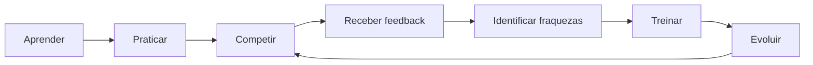

# 01 — Visão do produto

## 1. Resumo

DevLeague trata programação como habilidade treinável e competição como um mecanismo de prática recorrente. A analogia pública “o Chess.com da programação” descreve o comportamento desejado — entrar, jogar, ver resultado e repetir — e não autoriza copiar identidade visual ou reduzir o produto a um online judge.

## 2. Problema

As ferramentas atuais resolvem partes isoladas: conteúdo, exercícios, execução, competição, ensino ou avaliação. A oportunidade de longo prazo é conectar essas partes a uma identidade contínua. A oportunidade imediata é descobrir se um X1 curto, justo e confiável é divertido para o público brasileiro.

## 3. Hipóteses

### Hipótese central da V0.1

Jogadores que concluem uma partida demonstram intenção de repetir por meio de revanche, nova busca ou retorno posterior.

### Hipóteses auxiliares

- Convites privados reduzem o problema de cold start.
- Prática solo oferece valor quando não há adversário.
- Um problema e aproximadamente dez minutos mantêm a partida compreensível.
- Resultado rápido e confiável vale mais no MVP que análise sofisticada.
- Rating aumenta o significado do matchmaking público sem criar pay-to-win.

Todas são hipóteses, não fatos. Os sinais e checkpoints estão em [15_ROADMAP.md](15_ROADMAP.md).

## 4. Público da alpha

- Pessoas no Brasil, com 18 anos ou mais, aprendendo ou praticando programação.
- Estudantes universitários e de cursos técnicos que já sejam maiores de idade.
- Desenvolvedores iniciantes/intermediários e praticantes de programação competitiva.
- Usuários capazes de programar no desktop em ao menos uma linguagem suportada.

A limitação 18+ é temporária e reduz o escopo jurídico da alpha. Ela não redefine o público futuro. Antes de admitir menores, é obrigatória a revisão descrita em [15_ROADMAP.md](15_ROADMAP.md#gate-para-abrir-a-menores-de-18-anos).

## 5. Proposta de valor

**Promessa curta:** Aprenda. Pratique. Compita. Evolua.

Na V0.1: encontre um adversário compatível ou convide um amigo, resolva o mesmo problema e receba um resultado claro, rápido e confiável.

No longo prazo: transformar atividade, aprendizado, competição e evidências verificadas em dimensões distintas de evolução. Nunca criar “nota universal de programador”.

## 6. Princípios de produto

1. **Jogar primeiro:** a ação principal da home é `Jogar`.
2. **Free e justo:** pagamento futuro nunca altera rating, testes ou vantagem competitiva.
3. **Servidor autoritativo:** cliente não decide tempo, vencedor ou rating.
4. **Evidência, não acusação:** integridade futura apresenta sinais observáveis e decisão humana.
5. **Brazil-first:** PT-BR, contexto e comunidade brasileira são primeira classe.
6. **Desktop-first para código:** áreas de consumo podem responder a telas menores; o editor não promete experiência mobile completa.
7. **Privacidade e segurança por design:** coleta mínima e judge tratado como ambiente hostil.
8. **Presente correto:** não construir Education, Talent ou Platform API agora; evitar acoplamentos baratos de prevenir.

## 7. Modelo conceitual de longo prazo

As dimensões permanecem separadas:

| Dimensão | Significado | Não significa |
|---|---|---|
| XP (futuro) | atividade e progresso | habilidade competitiva |
| Rating | desempenho competitivo | competência profissional total |
| Learning progress (futuro) | avanço em conteúdo | rating |
| Verified skills (futuro) | habilidade demonstrada sob condição definida | badge comprado |

## 8. Não objetivos da V0.1

Não ser LMS, rede social completa, portal de carreiras, curso, detector de IA, plataforma de anúncios, marketplace, API pública ou app móvel. O inventário completo está em [02_ESCOPO_MVP_V0_1.md](02_ESCOPO_MVP_V0_1.md).

## 9. Métrica norteadora

**Taxa de intenção de repetir após partida concluída**, decomposta em revanche, nova busca na mesma sessão e retorno para nova partida. Não usar apenas cadastros, page views ou código executado como prova de valor.

## 10. Guardrails

- Conclusão e justiça percebida não podem ser sacrificadas para elevar volume.
- Taxa de falha atribuível ao judge deve ser acompanhada separadamente de erro do usuário.
- Não usar dark patterns de streak, urgência ou perda na V0.1.
- Telemetria de produto não inclui código-fonte por padrão.

