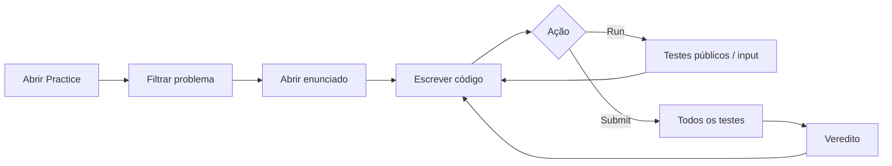
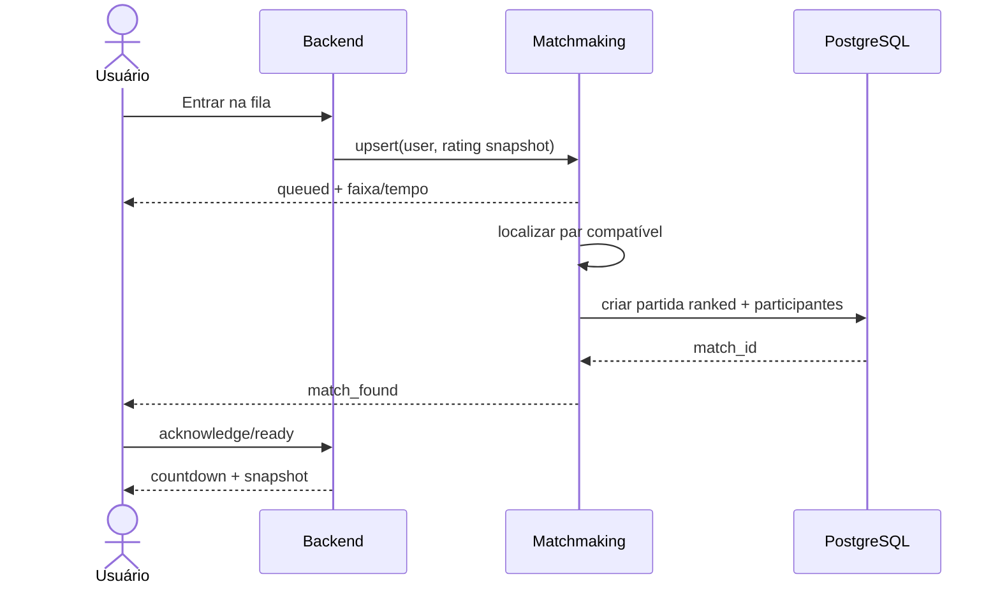

# 04 — Fluxos de usuário

## 1. Cadastro e onboarding

1. Visitante escolhe `Criar conta`.
2. Informa e-mail, credencial conforme provider de auth e username.
3. Declara 18+ e aceita versões atuais dos termos e privacidade.
4. Sistema normaliza/reserva username e cria perfil/rating inicial.
5. Confirma e-mail quando configurado.
6. Onboarding apresenta linguagens e teste rápido do editor, sem avaliação de habilidade.
7. Home oferece `Jogar`, `Desafiar amigo` e `Praticar`.

Falhas: username ocupado oferece alternativas; e-mail existente orienta login/recuperação; usuário abaixo de 18 não pode prosseguir na alpha; criação parcial deve ser reconciliável e idempotente.

## 2. Practice

Practice não altera rating. Um problema visto/aberto entra no histórico de exposição usado pelo seletor competitivo.

## 3. X1 privado

1. Criador escolhe `Desafiar amigo` e recebe link/código com expiração.
2. Convidado autentica e entra se houver vaga.
3. Lobby exibe ambos, caráter `Sem rating`, conexão e readiness.
4. Ambos confirmam; servidor seleciona/congela problema e inicia countdown.
5. Durante 10 minutos, cada um programa, executa e submete.
6. Vence a solução correta admitida primeiro pelo servidor; se uma submissão anterior ainda estiver pendente, o resultado aguarda sua avaliação. Sem Accepted, empate por tempo.
7. Resultado mostra `Sem alteração de rating`, tempos e submissões.
8. Revanche cria novo lobby/partida unranked.

Estados de exceção: convite expirado, lobby cheio, mesmo usuário, participante saiu, problema indisponível, provider degradado e reconexão.

## 4. Matchmaking ranked

Cancelar antes do par remove a entrada. Após `match_found`, falhar repetidamente em confirmar pode gerar cooldown. Revanche após ranked é privada/unranked; nova ranked exige nova fila.

## 5. Partida ativa

- Cliente recebe snapshot com `server_now`, `starts_at`, `ends_at`, problema versionado e estado próprio.
- Editor salva rascunho local; persistência de rascunho no servidor não é requisito.
- `Run` mostra resultado próprio e não é transmitido como conteúdo ao adversário.
- Indicadores do adversário são mínimos: conectado/desconectado e quantidade de submissões; nunca código ou testes.
- `Submit` recebe ack com ID; atualização posterior traz veredito.
- Resultado pode ocorrer com submissões posteriores pendentes, mas nunca enquanto uma submissão elegível anterior ao melhor Accepted estiver pendente; o servidor finaliza pela ordem de admissão autoritativa.

## 6. Reconexão

1. Cliente detecta queda e mantém editor local.
2. Reconecta com sessão e último `event_seq` conhecido.
3. Servidor revalida autorização.
4. Envia eventos faltantes quando disponíveis e sempre um snapshot atual.
5. Cliente substitui estado competitivo local pelo snapshot, preservando código local.
6. Se partida terminou, navega ao resultado.

O relógio não pausa. Falha da recuperação nativa do transporte sempre cai para ressincronização por snapshot.

## 7. Timeout

1. Ao chegar em `ends_at`, backend bloqueia novas submissões.
2. Se há submissões aceitas pelo backend antes do prazo, entra em `RESOLVING` até deadline técnico.
3. Accepted pendente pode vencer.
4. Sem Accepted, `DRAW_TIMEOUT`; se infraestrutura não consegue resolver com segurança, `VOID_SYSTEM`.

## 8. Abandono

`Abandonar` apresenta consequência. Em partida ativa, confirmação gera forfeit. Fechar a aba não é abandono explícito. Antes do início, sair cancela lobby sem resultado.

## 9. Resultado e repetição

Resultado MUST mostrar vencedor/empate, razão, tempo, submissões próprias, rating anterior/delta/novo apenas em ranked e ações `Revanche` e `Nova partida`. `Nova partida` retorna à fila se a anterior era ranked ou oferece escolha clara.

## 10. Exclusão/exportação

Configurações permitem solicitar exportação ou exclusão. Na alpha, processo pode criar ticket operacional autenticado. A interface explica efeitos, retenções obrigatórias e anonimização do histórico quando exclusão imediata afetaria integridade referencial.
