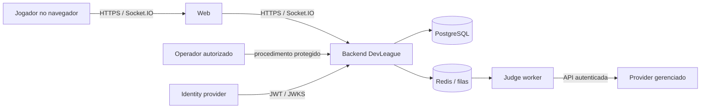
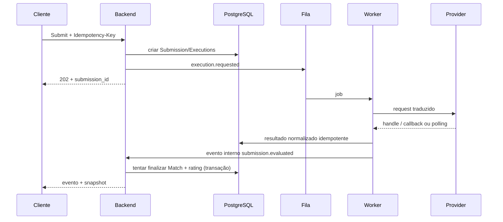

# 07 — Arquitetura do sistema

## 1. Decisão resumida

V0.1 usa **monólito modular**, frontend separado e worker de integração com judge. O worker é um processo implantável separado por confiabilidade e credenciais, mas pertence ao mesmo codebase e modelo de domínio. Não há microservices.

Stack recomendada no planejamento:

- **Web:** Next.js + React + TypeScript; Monaco carregado sob demanda.
- **Backend:** NestJS + TypeScript, HTTP REST e gateway Socket.IO.
- **Persistência:** PostgreSQL e migrations SQL/ORM versionadas.
- **Efêmero/fila:** Redis + BullMQ (ou equivalente compatível escolhido na implementação).
- **Auth:** Supabase Auth gerenciado, e-mail/senha no MVP, JWT validado pelo backend; autorização continua no domínio.
- **Judge:** provider gerenciado ainda não escolhido, atrás de `CodeExecutionPort`.
- **Observabilidade:** logs JSON, métricas OpenTelemetry-compatible e error tracking sem código.

Versões exatas devem ser as estáveis suportadas no início da implementação e registradas em lockfiles/ADR, não adivinhadas nesta especificação.

## 2. Contexto



## 3. Containers

| Container | Responsabilidade | Não deve fazer |
|---|---|---|
| Web | renderização, navegação, editor e projeção de estado | decidir resultado, guardar secret ou chamar judge |
| Backend | domínio, REST, realtime, autorização, transações e enqueue | executar código do usuário |
| Worker | traduzir porta interna↔provider, polling/callback, normalização | aplicar rating ou decidir vencedor fora do domínio |
| PostgreSQL | fonte transacional e histórico | fila efêmera de presença |
| Redis | jobs, locks curtos, presença e coordenação | fonte definitiva de resultado/rating |
| Auth | credenciais, recuperação, emissão de tokens | autorização de recursos DevLeague |
| Judge provider | compilar/executar em isolamento | acessar DB/rede interna ou determinar vencedor |

## 4. Módulos do backend

- `Identity`: vínculo `auth_subject`→User, aceite e suspensão.
- `Profiles`: username, avatar e preferências.
- `Problems`: versões, categorias, publicação, exposição e seleção.
- `Practice`: sessões/submissões não competitivas.
- `Matchmaking`: fila, compatibilidade, heartbeat e criação de par.
- `Matches`: aggregate de lobby/partida, lifecycle, abandono e resultado.
- `Submissions`: admissão, idempotência, estado e veredito normalizado.
- `Execution`: porta, job, adapter e correlação externa.
- `Ratings`: política Elo e histórico atômico.
- `Realtime`: autenticação do socket, rooms, eventos e snapshots.
- `Telemetry/Ops`: métricas, auditoria e health.

Dependências apontam para regras/domínio, não adapters. `Matches` pode consumir `Submissions` e `Ratings` por serviços de aplicação; `Execution` não importa `Matches`.

## 5. Fronteira do judge

```ts
interface CodeExecutionPort {
  submit(request: ExecutionRequest): Promise<ExecutionHandle>;
  getResult(handle: ExecutionHandle): Promise<ExecutionResult | null>;
  cancel?(handle: ExecutionHandle): Promise<void>;
}
```

Tipos contêm apenas conceitos DevLeague (`languageRuntime`, `source`, `stdin`, `expectedOutput`, limites, correlationId, verdict`). IDs/status do vendor existem somente no adapter e tabela de execução. Não criar descoberta dinâmica, marketplace de plugins ou configuração arbitrária por usuário.

## 6. Fluxo de submissão



Um outbox transacional SHOULD ligar gravação de Submission aos jobs/eventos. Na V0.1 pode ser tabela `outbox_events` publicada por worker interno, evitando dual write DB+Redis. Não é event sourcing.

## 7. Concorrência

- `match` é bloqueada ao admitir Submit para atribuir `admission_seq` monotônico e ao finalizar, permitindo observar todas as submissões anteriores comprometidas.
- `rating_account` dos dois usuários é bloqueada em ordem determinística de `user_id`.
- `result_version`/constraint impede dois resultados; uma Accepted aguarda qualquer `admission_seq` anterior ainda não terminal.
- `rating_history.match_id,user_id` é único.
- Idempotency key é única por usuário+operação+contexto.
- Locks Redis nunca protegem invariantes financeiras/competitivas sozinhos.

## 8. Realtime

Socket.IO é escolhido sobre WebSocket cru por reconexão, ack, rooms e integração NestJS. A documentação oficial informa ordenação, mas entrega padrão “at most once”; portanto eventos críticos possuem `event_id`, `seq`, persistência suficiente e snapshot de recuperação. Ver [11_REALTIME_MATCH_SPEC.md](11_REALTIME_MATCH_SPEC.md).

Serviço gerenciado realtime foi rejeitado no MVP porque autoridade e transações já residem no backend; adicionar outro modelo de autorização/entrega aumentaria coordenação.

## 9. Auth

Supabase Auth é recomendado porque oferece e-mail/senha, recuperação, JWT/JWKS e caminho para self-hosting, reduzindo implementação de credenciais. O backend valida assinatura, emissor, audiência e expiração e carrega User interno. JWT prova identidade, não permissão para uma partida.

Alternativas:

| Opção | Vantagem | Custo/risco | Decisão |
|---|---|---|---|
| Supabase Auth | managed + open source + PostgreSQL/JWT | dependência e política de MAU | recomendada |
| Clerk | excelente UX | lock-in/custo e modelo proprietário | alternativa |
| Auth.js | controle no app | credenciais e sessões recaem na equipe | não para alpha |
| Auth próprio | controle total | maior risco de segurança | rejeitado |

Antes da implementação confirmar região, DPA, e-mail transacional, limites e custo atual.

## 10. Dados e cache

PostgreSQL é adequado a invariantes, joins e transações de match/rating. Redis é justificado por filas e estado efêmero com TTL. Conteúdo público pode receber cache HTTP; dados competitivos nunca dependem de cache potencialmente antigo para decisão.

## 11. Implantação de referência

- Web em plataforma/CDN compatível com Next.js.
- Backend e worker em containers gerenciados, mesma região brasileira ou menor latência comprovada.
- PostgreSQL/Redis gerenciados com rede privada e backups.
- Judge acessado somente pelo worker via egress controlado.
- Ambientes `local`, `staging` e `production`; dados/secrets separados.

Fornecedor cloud é decisão operacional antes da implementação. Requisitos: conexão WebSocket persistente, deploy sem derrubar partidas (drain), health checks, região/latência, secret manager e custo previsível.

## 12. Escala evolutiva

1. Uma instância backend/worker é suficiente para alpha interna.
2. Escalar workers por profundidade da fila.
3. Escalar backend horizontalmente com adapter Redis Streams/coordenação e sticky session somente se requerido.
4. Separar serviço de execução apenas quando throughput/equipe/SLA provarem necessidade.
5. Nunca antecipar Education/Talent como módulos vazios.

## 13. Threat model resumido

| Ameaça | Limite de confiança | Mitigação principal |
|---|---|---|
| RCE/sandbox escape | código→provider | vendor diligence, isolamento, no network, limites, atualização |
| Fork/memory/output bomb | execução | quotas por job e conta, backpressure |
| SSRF/exfiltração | provider | rede negada, sem secrets/URLs internas no payload |
| Submit replay | cliente→backend | auth, idempotência, deadline server-side |
| WebSocket spoof/abuse | socket→gateway | JWT, autorização por room, schema/rate limit |
| Corrida de Accepted | workers→DB | transação e unique constraints |
| Test leak | API/storage | separação público/privado, autorização e logs redigidos |
| Supply chain | build/deploy | lockfile, scanning, provenance, menor privilégio |

## 14. Referências oficiais atuais

- [Supabase Auth architecture](https://supabase.com/docs/guides/auth/architecture)
- [Socket.IO delivery guarantees](https://socket.io/docs/v4/delivery-guarantees)
- [Socket.IO connection recovery](https://socket.io/docs/v4/connection-state-recovery)
- [NestJS gateways](https://docs.nestjs.com/websockets/gateways)
- [PostgreSQL transaction isolation](https://www.postgresql.org/docs/current/transaction-iso.html)

Consultadas em 2026-08-11. Revalidar no início da implementação.
