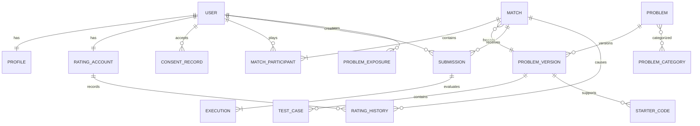

# 08 — Modelo de dados

Modelo conceitual da V0.1. Tipos físicos e nomes podem mudar na migration inicial, preservando invariantes.

## 1. ERD

## 2. Entidades

### User

`id UUID`, `auth_subject UNIQUE`, `status`, `created_at`, `updated_at`, `deleted_at?`. Não duplicar senha. `auth_subject` é opaco.

### Profile

`user_id PK/FK`, `username`, `username_normalized UNIQUE`, `avatar_ref?`, `preferred_languages[]?`, `created_at`, `updated_at`.

### ConsentRecord

Registro append-only: `id`, `user_id`, `document_type`, `document_version`, `accepted_at`, `age_declaration=OVER_18`, `source`. Retirada/novo aceite gera registro, não sobrescreve evidência.

### LanguageRuntime

Tabela/configuração controlada: `key` (`python`, `java`, `javascript`, `cpp`), `display_name`, `runtime_version`, `provider_mapping`, `enabled`, `default_limits JSONB`, `config_version`. `provider_mapping` pertence à camada de infraestrutura e nunca é enviado ao domínio/cliente além da versão pública.

### Problem / ProblemVersion

`Problem`: identidade estável e status. `ProblemVersion`: conteúdo imutável publicado, dificuldade, constraints, limites, `practice_visible`, `competitive_eligible`, solução de referência protegida, timestamps. Publicação posterior cria nova versão.

### ProblemCategory e join

Taxonomia curta (`logic`, `arrays`, `strings`, `math`, `debugging`). Join N:N permite mais de uma categoria sem duplicar problema.

### TestCase

`id`, `problem_version_id`, `kind PUBLIC|PRIVATE`, `ordinal`, `input_ref/encrypted_content`, `expected_ref/encrypted_content`, `weight`, `limits_override?`, `checksum`. Testes privados não passam pela API pública. Conteúdo grande deve usar object storage privado; V0.1 pode manter criptografado no banco se limites permanecerem pequenos e medidos.

### StarterCode

`problem_version_id`, `language_key`, `source`, `checksum`; único por versão+linguagem.

### ProblemExposure

`user_id`, `problem_id`, `first_seen_at`, `last_seen_at`, `source PRACTICE|MATCH`, `times_seen`; único por usuário+problema com upsert. Não armazenar por versão apenas, pois variação editorial pequena não torna problema inédito.

### Match

Campos principais:

- `id`, `type RANKED_PUBLIC|PRIVATE_UNRANKED`;
- `status`, `result_reason`, `winner_user_id?`;
- `problem_version_id?`, `duration_seconds`, `starts_at?`, `ends_at?`, `finished_at?`;
- `invite_token_hash?`, `invite_expires_at?`;
- `rating_policy_version?`, `repeated_exposure boolean`;
- `next_submission_seq integer` para ordenar admissões competitivas sob lock;
- `version integer` para optimistic concurrency; timestamps.

Constraints: problema obrigatório a partir de countdown; vencedor deve ser participante; ranked não tem invite; terminal é imutável salvo operação administrativa auditada.

### MatchParticipant

`match_id`, `user_id`, `slot`, `ready_at?`, `joined_at`, `forfeited_at?`, `connection_state?`, `rating_snapshot?`, `result WIN|LOSS|DRAW|VOID?`. PK composta; unique match+slot.

Presença de alta frequência fica no Redis, não em updates contínuos da tabela.

### Submission

`id`, `user_id`, `context PRACTICE|MATCH_RUN|MATCH_SUBMIT`, `match_id?`, `admission_seq?`, `problem_version_id`, `language_runtime_key/version`, `source_ref/encrypted_source`, `source_sha256`, `status`, `verdict`, `eligible_received_at`, `accepted_at?`, `idempotency_key`, `created_at`, `finished_at?`.

Constraints: usuário deve participar do match; apenas `MATCH_SUBMIT` pode vencer; `match_id,admission_seq` é único; idempotency unique por usuário+contexto; registro imutável após terminal exceto metadados técnicos controlados. A admissão de Submit bloqueia Match, valida deadline e incrementa `next_submission_seq`, evitando uma submissão anterior não visível durante a finalização.

### Execution

Uma submission pode exigir uma ou várias execuções conforme adapter/test strategy. Campos: `id`, `submission_id`, `attempt`, `provider_key`, `provider_handle_encrypted?`, `status`, limites normalizados, `started_at`, `finished_at`, `cpu_ms?`, `wall_ms?`, `memory_kb?`, `stdout_ref/truncated?`, `stderr_ref/truncated?`, `provider_error_code?`, `correlation_id`.

IDs externos nunca são chave de domínio. Unique `submission_id,attempt`.

### RatingAccount / RatingHistory

`RatingAccount`: `user_id PK`, `current_rating`, `peak_rating`, `games`, `wins`, `losses`, `draws`, `algorithm_version`, timestamps.

`RatingHistory`: `id`, `user_id`, `match_id`, `before`, `expected_score`, `actual_score`, `delta`, `after`, `algorithm_version`, `created_at`; unique user+match.

### OutboxEvent

`id`, `aggregate_type`, `aggregate_id`, `event_type`, `schema_version`, `payload` sem código, `created_at`, `published_at?`, `attempts`. Mantém atomicidade DB→fila/realtime sem adotar event sourcing.

### AuditLog

`id`, `actor_user_id?`, `actor_type`, `action`, `target_type/id`, `metadata` redigido, `created_at`, `request_id`. Append-only com acesso restrito.

## 3. Estado efêmero Redis

- `mm:entry:{userId}` TTL + índice por bucket;
- `presence:match:{matchId}:{userId}` TTL;
- jobs de execução/outbox;
- rate limit counters;
- recovery/event buffer curto conforme adapter realtime.

Nunca armazenar source code, testes privados ou token de convite em claro no Redis além do job estritamente necessário; preferir IDs para buscar payload no banco.

## 4. Invariantes físicas

1. Unique parcial: usuário em no máximo um match não terminal; pode ser reforçada por tabela `active_engagement` com `user_id PK`.
2. Unique: um `RatingHistory` por user+match.
3. Check: `ends_at > starts_at`; duration dentro de faixa segura.
4. Check: rating/deltas inteiros e não negativos após cálculo.
5. FK: winner deve ser validado transacionalmente como participante (trigger ou domínio + teste; SQL FK composta se conveniente).
6. Terminal match não retorna a estado ativo.
7. `PRIVATE_UNRANKED` nunca possui histórico de rating.

## 5. Transação de Accepted

1. Marcar Submission Accepted idempotentemente.
2. Bloquear Match e verificar elegibilidade/estado.
3. Localizar o menor `admission_seq` Accepted.
4. Se houver sequência anterior não terminal, manter/entrar em `RESOLVING` e não declarar vencedor.
5. Caso contrário, definir winner/reason/finished pelo menor Accepted.
6. Se ranked, bloquear RatingAccounts em ordem de UUID, calcular e persistir ambos/históricos.
7. Gravar outbox e commit; somente depois publicar evento.

## 6. Retenção proposta para revisão jurídica

| Dado | Proposta alpha | Observação |
|---|---|---|
| Conta/perfil | enquanto ativa + janela de exclusão | minimizar campos |
| Aceites/auditoria legal | prazo jurídico a definir | acesso muito restrito |
| Source de Practice | 90 dias | permitir exclusão antecipada |
| Source de partida | 180 dias | contestação/fair play; revisar necessidade |
| stdout/stderr detalhado | 30 dias | truncar e remover secrets acidentais |
| Métrica agregada | retenção longa se anonimizada | validar anonimização |
| IP/security logs | 30–90 dias | definir por risco/finalidade |
| Provider | menor retenção contratualmente possível | exigir exclusão/DPA |

**DECISÃO PENDENTE antes da alpha:** prazos finais e bases legais após revisão profissional. Não usar esta tabela como parecer jurídico.

## 7. Exclusão

Soft delete não basta. Processo deve remover credenciais no Auth, PII e código conforme política; histórico competitivo pode ser anonimizado para preservar integridade (`Deleted user`) quando base legal permitir. Backups expiram pelo ciclo documentado e não são usados para restaurar conta apagada fora de desastre.

## 8. Fora do schema

Sem organizações, turmas, escolas, vagas, empresas, pagamentos, XP, achievements, IA, marketplace, certificados ou API keys públicas.
