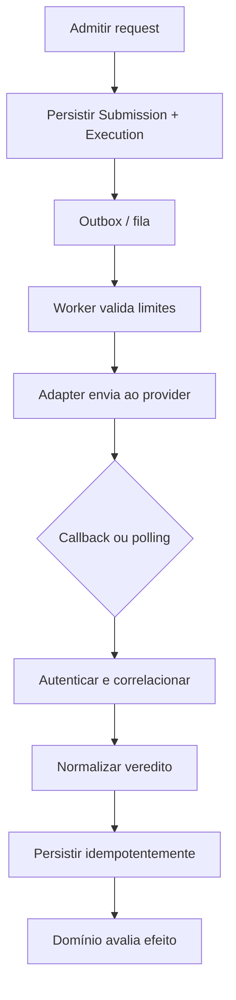

# 10 — Code Judge Specification

## 1. Objetivo e postura de segurança

Executar código enviado pelo usuário é a maior fronteira de risco do MVP. A V0.1 prefere provider gerenciado, mas **nenhum fornecedor está escolhido**. Seleção exige diligência e spike. O provider é operador técnico, não autoridade de domínio.

Princípios:

1. Código é hostil.
2. Execução não recebe secrets, rede interna ou credencial de usuário.
3. DevLeague decide elegibilidade, problema, vencedor e rating.
4. Provider retorna fatos técnicos que o adapter normaliza.
5. Falha sistêmica não vira erro do jogador.
6. Troca de provider não modifica Match, Submission ou Practice.

## 2. Escopo V0.1

- Código single-file e stdin/stdout.
- Python, Java, JavaScript/Node.js e C++ em versões fixas.
- `Run`: input/testes públicos; resposta pode incluir stdout.
- `Submit`: todos os testes privados; cliente recebe apenas veredito agregado e diagnóstico seguro.
- Sem pacotes externos, internet, multi-file, Docker do usuário, arquivos persistentes ou sessão interativa.

## 3. Contrato interno

```ts
type Verdict =
  | 'ACCEPTED' | 'WRONG_ANSWER' | 'COMPILE_ERROR' | 'RUNTIME_ERROR'
  | 'TIME_LIMIT_EXCEEDED' | 'MEMORY_LIMIT_EXCEEDED'
  | 'OUTPUT_LIMIT_EXCEEDED' | 'SYSTEM_ERROR' | 'CANCELLED';

type ExecutionRequest = {
  correlationId: string;
  runtime: { language: 'python'|'java'|'javascript'|'cpp'; version: string };
  source: string;
  cases: Array<{ caseId: string; stdin: string; expectedOutput?: string }>;
  limits: {
    cpuMs: number; wallMs: number; memoryKb: number;
    processes: number; outputBytes: number; fileBytes: number;
  };
  network: 'DENY';
};

type ExecutionResult = {
  verdict: Verdict;
  caseResults?: Array<{ caseId: string; verdict: Verdict; cpuMs?: number; memoryKb?: number }>;
  stdout?: string; stderr?: string; compileOutput?: string;
  usage: { cpuMs?: number; wallMs?: number; peakMemoryKb?: number };
  providerFailure?: { retryable: boolean; category: string };
};
```

`providerFailure.category` é taxonomia DevLeague, sem expor mensagens internas. O adapter guarda handle/códigos externos em `Execution` para operação.

## 4. Pipeline



## 5. Limites mínimos exigidos

Provider MUST suportar ou contratualmente impor:

- CPU e wall-clock timeout independentes;
- memória/stack quando aplicável;
- máximo de processos/threads para fork bomb;
- filesystem efêmero e quota de arquivo;
- output truncado/limitado;
- rede desabilitada, sem override pelo código/cliente;
- limpeza entre execuções;
- limite de source/input;
- isolamento entre tenants/jobs;
- rate/concurrency/backpressure observáveis.

Valores por linguagem/problema são calibrados. Sugestão de ponto inicial, não aprovação: CPU 1–2 s por caso, wall 2–5× CPU, memória 256 MB (mais para JVM se necessário), source 64 KiB, output 64 KiB e poucos processos. Publicar problema somente depois de benchmark p50/p95 e margens nas quatro linguagens.

## 6. Testes e veredito

- Comparador padrão ignora diferenças finais de newline e pode ignorar whitespace conforme configuração do problema; regra deve ser explícita.
- Floating point exige checker/tolerância definida; não aplicar tolerância global.
- Testes privados são identificados internamente e enviados somente ao provider.
- Se provider executar um caso por request, adapter agrega com fail-fast seguro; se oferecer Problems API, mapeia resultado agregado sem transferir autoria do problema.
- `SYSTEM_ERROR`, timeout da API, callback inválido ou resultado inconsistente pode ser retryado com nova `attempt`; nunca converter para WA.
- Retry não altera `eligible_received_at` da submissão competitiva.

## 7. Quotas e prioridade

- Limite inicial sugerido: Run 10/min e Submit 5/min por usuário, além de burst/IP e limite global; calibrar em teste.
- Match Submit tem prioridade sobre Practice Run, mas nenhuma fila pode sofrer starvation indefinido.
- Ao superar capacidade, rejeitar antes de aceitar trabalho (`429/503 + Retry-After`) ou manter prazo máximo de fila explícito.
- Circuit breaker abre após erro/latência sustentados; matchmaking ranked é pausado se novos matches não puderem ser julgados justamente.

## 8. Avaliação de fornecedores (fontes consultadas em 2026-08-11)

### 8.1 Resumo factual

| Critério | Judge0 Cloud | Judge0 self-hosted | Sphere Engine Problems | JDoodle Compiler API |
|---|---|---|---|---|
| Modelo | cloud shared/dedicated; preço atual precisa de proposta/painel | open source + custo infra/operação | comercial, proposta individual; trial 14 dias | API gerenciada por créditos diários/planos |
| Linguagens MVP | documentação lista catálogo; confirmar versões exatas no tenant | configurável; projeto suporta muitas | docs citam C++, Java, Node.js e Python | docs atuais listam 110+; confirmar versões |
| Test cases/judging | submissions por stdin/expected output; agregação pode ser DevLeague | igual, controlável | Problems API tem casos, judges e master judge | execute REST/WS; agregação fica no DevLeague |
| CPU/memória/timeout | API tem campos; quotas do plano precisam confirmação | configuráveis; defaults não são política segura | tempo por caso; memória/resultados; parâmetros customizados por oferta | retorna CPU/memória; timeouts documentados, controle fino precisa confirmar |
| Concorrência/rate | **confirmar por proposta/tenant** | dimensionado pela equipe; `max_queue_size` configurável | **confirmar por proposta** | créditos e 429 documentados; concorrência precisa confirmar |
| Isolamento | declaração do produto; exigir whitepaper/DPA/pentest/SLA | usa Isolate/Docker; operação e hardening são nossos | status inclui illegal syscall; exigir documentação contratual | afirma execução segura; exigir evidências contratuais |
| Callback/observabilidade | API suporta callback URL/status/health; confirmar Cloud | controlável | webhooks e consulta de status | REST/WS; não foi encontrada garantia equivalente de webhook na pesquisa |
| Privacidade/retenção | exigir DPA, região, suboperadores, deletion e retenção de source | controle máximo; backups/logs são responsabilidade própria | política pública é GDPR para usuários do site; DPA de API/source precisa proposta | política/DPA específica de código precisa diligência |
| SLA/disponibilidade | não assumir; obter contrato | nossa responsabilidade | níveis de suporte/oferta customizados; obter SLA | obter plano/contrato |
| Lock-in/migração | API mapeada no adapter; self-host oferece caminho semelhante | baixo no código, alto operacional | Problems API rica aumenta lock-in se problemas residirem lá | baixo/moderado se usar só execute |

`JDoodle` é a quarta alternativa justificada porque possui API oficial gerenciada, modelo público de créditos, REST/WebSocket e suporta as linguagens do MVP. Ela permanece opção secundária: a pesquisa pública não demonstrou o mesmo controle de problem judging, limites, webhooks, SLA e tratamento de source exigidos; isso deve ser confirmado, não presumido.

### 8.2 Trade-offs

**Judge0 Cloud:** interface próxima do caminho self-hosted e campos de limites são atraentes. A página atual distingue Shared, Hybrid Dedicated e Full Dedicated, mas preços/limites não ficaram publicamente verificáveis na documentação acessada. Exigir cotação e não basear decisão em planos de terceiros (RapidAPI etc.) sem comparar contrato direto.

**Judge0 self-hosted:** dá controle, portabilidade e inspeção. Traz patching de SO/kernel/container/isolate, capacidade, incidentes e risco de má configuração. A documentação pública histórica mostra rede habilitável e default que pode ser inseguro para este caso; uma implantação DevLeague MUST negar rede e impedir override. Não é a escolha do piloto aprovado.

**Sphere Engine:** Problems API já modela test cases, judges, webhooks e vereditos, e o comercial oferece cloud/on-premise. Pode reduzir construção de judging, mas armazenar problems/testes no vendor aumenta lock-in. Preço é proposta individual baseada em escopo/submissões/suporte; custo real exige cotação.

**JDoodle:** simples para executar código e bom para spike de Compilers API. Modelo diário de créditos e timeout genérico pode ser menos adequado a bursts competitivos; plano, concorrência, limite configurável, retention e DPA precisam confirmação.

## 9. Scorecard de contratação

Usar pesos antes de conhecer propostas, para evitar escolher pelo nome:

| Grupo | Peso sugerido |
|---|---:|
| Segurança/isolamento/controles | 25% |
| Privacidade, retenção, DPA, região | 15% |
| Latência, throughput, concorrência | 15% |
| Casos de teste, limites e linguagens | 15% |
| Custo total e previsibilidade | 15% |
| Disponibilidade, suporte e observabilidade | 10% |
| Portabilidade/integração | 5% |

Desclassificadores: rede não desabilitável; retenção/uso de source incompatível; ausência de DPA adequado; isolamento sem evidência mínima; impossibilidade de limites; termos que permitam treinar/reutilizar código sem opt-in; ausência de resposta a incidente.

## 10. Perguntas obrigatórias ao fornecedor

1. Preço por request, tempo, crédito, slot ou pacote? Há mínimo, overage e cobrança de failed/retry/test case?
2. Burst, concurrent executions, queue, rate limits e processo de aumento?
3. Regiões, p50/p95 observados, SLA e créditos por indisponibilidade?
4. Versões exatas das quatro linguagens e política de atualização/depreciação?
5. Limites configuráveis e isolamento de compile vs run?
6. Rede, syscall, filesystem, processes, output e limpeza entre jobs?
7. Source/input/output são persistidos, logados, usados para treinamento ou acessados por suporte? Por quanto tempo?
8. DPA, suboperadores, transferência internacional, criptografia, deletion API e incident notification?
9. Callbacks são assinados? Há polling, idempotência e request correlation?
10. Métricas/status page/audit export e suporte durante incidente?
11. Como exportar/migrar problems/testes/resultados? Há on-prem/self-host path?

## 11. Spike de aceitação

Executar com cada finalista:

- 100+ soluções golden/WA/CE/RE/TLE/MLE nas quatro linguagens;
- fork/process bomb, loop, output bomb, filesystem, tentativa de rede/DNS e leitura de ambiente;
- burst equivalente a 20 submits/s e 100 partidas simultâneas;
- callback duplicado, atrasado, inválido e fora de ordem;
- cancelamento/retry, indisponibilidade e rate limit;
- medição p50/p95/p99 e custo projetado por partida;
- verificação de deletion/retention com evidência do vendor.

Seleção final exige ADR-004 atualizada de `Proposed` para `Accepted`.

## 12. Referências oficiais

- [Judge0 docs/pricing](https://docs.judge0.com/products/judge0/pricing/), [API/GitHub](https://github.com/judge0/judge0)
- [Sphere Engine pricing](https://sphere-engine.com/pricing), [Problems API](https://docs.sphere-engine.com/problems/api/overview-version-4), [webhooks](https://docs.sphere-engine.com/webhooks/overview), [privacy](https://sphere-engine.com/privacy-policy)
- [JDoodle Compiler API](https://www.jdoodle.com/docs/compiler-apis/jdoodle-api-quickstart/rest-apis), [credits](https://www.jdoodle.com/docs/compiler-apis/api-credits), [timeouts](https://www.jdoodle.com/docs/compiler-apis/api-timeout-errors/), [languages](https://www.jdoodle.com/docs/compiler-apis/supported-languages-versions)

Links e condições comerciais devem ser revalidados na contratação.

