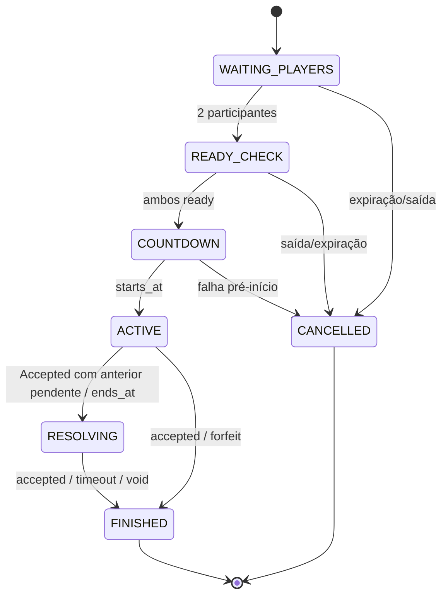

# 11 — Realtime Match Specification

## 1. Transporte e autoridade

Socket.IO sobre TLS, namespace `/matches`. JWT é enviado no handshake e revalidado; entrada em room depende de participação persistida. HTTP permanece fallback para snapshot/commands críticos. Servidor é autoridade de estado e tempo.

Ordenação do transporte não garante chegada após queda. Cada evento crítico tem `eventId`, `matchId`, `seq`, `occurredAt`, `schemaVersion` e `payload`. Cliente ignora duplicados, detecta gap e solicita snapshot.

## 2. Lifecycle



Transições são comandos de domínio transacionais; gateway não altera status diretamente.

## 3. Envelope

```json
{
  "eventId": "evt_01...",
  "event": "match.submission.updated",
  "schemaVersion": 1,
  "matchId": "uuid",
  "seq": 19,
  "occurredAt": "2026-08-11T20:05:01.123Z",
  "payload": {}
}
```

Ack de command:

```json
{
  "commandId": "cmd_01...",
  "accepted": true,
  "serverNow": "...",
  "currentSeq": 19
}
```

`accepted=true` significa command recebido/aplicado, não Accepted do judge.

## 4. Eventos servidor→cliente

| Evento | Dados mínimos | Persistência |
|---|---|---|
| `match.snapshot` | estado completo autorizado | gerado sob demanda |
| `match.participant.joined` | participante | outbox/event buffer |
| `match.ready.changed` | user, ready | idem |
| `match.countdown.started` | startsAt/endsAt | persistido |
| `match.started` | problema/version, timestamps | persistido |
| `match.presence.changed` | user, connected | efêmero; não competitivo |
| `match.submission.acknowledged` | submissionId, receivedAt | persistido |
| `match.submission.updated` | próprio: veredito; rival: apenas count | persistido/projeção |
| `match.ended` | reason, winner, rating summary | persistido |
| `match.cancelled` | reason | persistido |
| `match.resync.required` | currentSeq | efêmero |
| `system.degraded` | capability/retry | operacional |

Testes privados, código e detalhes do rival nunca são emitidos.

## 5. Commands cliente→servidor

| Command | Validações |
|---|---|
| `match.join` | JWT, participant, estado |
| `match.ready.set` | participant, READY_CHECK, boolean |
| `match.heartbeat` | participant, rate limit |
| `match.forfeit` | ACTIVE/RESOLVING, confirmação UI |
| `match.sync.request` | participant, lastSeq opcional |
| `matchmaking.join/leave` | usar preferencialmente HTTP idempotente; realtime pode notificar |

Run/Submit SHOULD usar HTTP para idempotência, tamanho e resposta 202; resultado chega realtime.

## 6. Countdown e relógio

- `startsAt` é definido antes do countdown, pelo servidor.
- Cliente calcula `remaining = endsAt - estimatedServerNow`; sincroniza offset por resposta/heartbeat.
- Display pode interpolar localmente, mas ao divergir aceita snapshot.
- Backend agenda timeout e também verifica prazo em cada command/job; scheduler perdido não estende partida.

## 7. Reconexão

1. Socket reconecta com JWT válido, `matchId` e `lastSeq`.
2. Middleware reexecuta autorização; não pular validação em recuperação.
3. Se buffer possui gap, emitir faltantes e snapshot final.
4. Se não possui, emitir snapshot.
5. Cliente reconcilia por `seq`; código local não é sobrescrito.

Janela de recovery sugerida: duração da partida + margem, limitada. Redis Streams é preferível ao Pub/Sub caso se use recovery distribuída, pois Pub/Sub não persiste pacotes. Para uma instância, adapter em memória pode servir à alpha, mas snapshot continua obrigatório.

## 8. Presença

Heartbeat a cada ~10 s, offline após ~30 s são hipóteses configuráveis. Presença não decide derrota. `connected=false` é informação aproximada e deve ser apresentada assim.

## 9. Match found

- Matchmaking persiste a partida antes do evento.
- Evento perdido é recuperável por `GET /matchmaking/entry` ou `/me` engagement ativo.
- Confirmação/ready tem deadline configurado; falha pré-`ACTIVE` cancela sem rating.
- Cooldown por repetidas ausências é regra antifila, gradual e auditável.

## 10. Accepted simultâneo

Workers podem concluir fora de ordem. A ordem do provider não determina vitória. Cada Submit competitivo recebe `admission_seq` monotônico sob lock da partida; cada resultado terminal chama uma transação:

```text
lock match
if terminal -> no-op
if submission not eligible -> no-op
candidate = accepted submission with lowest admission_seq
if any earlier submission is non-terminal -> set/keep RESOLVING; commit
else mark candidate owner as winner
apply rating once when ranked
append event
commit
```

A menor sequência Accepted vence, independentemente da ordem de callbacks. Métricas registram diferença entre `eligible_received_at` e `accepted_at` para investigar latência e tempo em `RESOLVING`.

## 11. Falhas

| Falha | Comportamento |
|---|---|
| WebSocket cai | reconectar; relógio segue; HTTP snapshot disponível |
| Backend reinicia | estado vem do DB; scheduler reconcilia partidas vencidas |
| Redis cai | bloquear nova fila/jobs; partidas usam DB/snapshot; não inventar resultado |
| Provider degrada | circuit breaker; pausar novos ranked; resolver/retry ou void |
| Evento duplicado | dedupe por eventId/seq e idempotência de command |
| Gap | snapshot autoritativo |
| Cliente com relógio errado | display corrige; decisão server-side inalterada |

## 12. Rate limits e segurança

- Limitar connections por usuário/IP, handshakes, joins, heartbeats e commands.
- Validar origem/CORS, schema e tamanho; não confiar em room solicitada.
- Desconectar token expirado/revogado conforme política e permitir refresh controlado.
- Evitar PII/token em query logs; preferir auth payload seguro.
- Backpressure e payload máximo impedem memory bomb no gateway.

## 13. Testes de aceitação

- evento perdido seguido de snapshot;
- refresh de aba durante countdown/active/result;
- dupla conexão do mesmo usuário;
- token expira/revoga;
- backend reinicia aos 9:59;
- duas Accepted paralelas em processos distintos;
- forfeit concorrente com Accepted;
- endsAt concorrente com Submit;
- 200 sockets/100 matches e reconnection storm.

Referências: [delivery guarantees](https://socket.io/docs/v4/delivery-guarantees) e [connection state recovery](https://socket.io/docs/v4/connection-state-recovery), consultadas em 2026-08-11.
